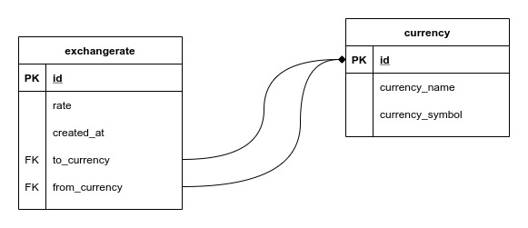

# Django Python Web Framework Project

[Heroku Demo Link](https://converter-django.herokuapp.com/)

## Message Converter

- [Heroku Demo Link](https://converter-django.herokuapp.com/practice-1/message-converter/)
- Application to convert message to all lower-case.

---

## Currency Converter

- [Heroku Demo Link](https://converter-django.herokuapp.com/practice-2/currency-converter)
- Application to convert currency with the amount, from_currency, to_currency provided.
- Free API Used: https://free.currencyconverterapi.com/

### Currency Application

#### REST API created to query all currencies

- [GET] /api/currency
- Response
  ```json
  {
    "currencies": {
      "id": "USD",
      "currency_name": "United States Dollar",
      "currency_symbol": null
    },
    ...
  }
  ```

#### REST API created to query exchange rate

- [GET] /api/currency/exchange-rate?from_currency=USD&to_currency=MYR
- Parameters required
  1. from_currency: Currency ID
  2. to_currency: Currency ID
- Response
  ```json
  {
    "from_currency": {
      "id": "USD",
      "currency_name": "United States Dollar"
    },
    "to_currency": {
      "id": "MYR",
      "currency_name": "Malaysian Ringgit"
    },
    "rate": 4.238039
  }
  ```

### Database Design


